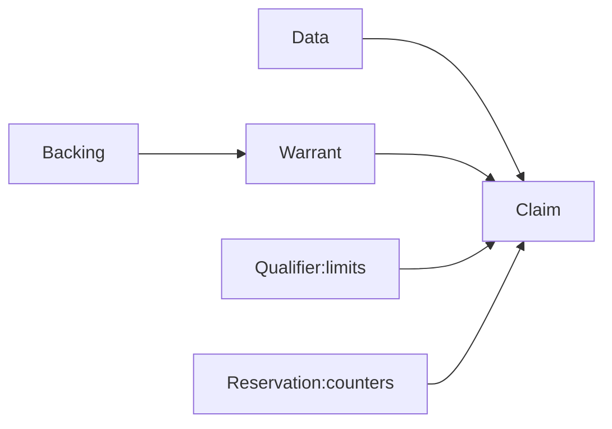

# Evaluation Methods & Statistics

## Lecture 1: Introduction

### 1. What do we mean by evaluation?

- Evaluation involves making a claim.
  - X is *fit for purpose*.
  - X is *better than* Y.
- A claim is supported by evidence.
  - X can be *measured* from a test.
- A claim can be proven or disproven.
  - At least, be tested.

### 2. What do we mean by claim?

- Science is not about taking for **granted**.

- Science is about **doubting** if the claim
  - is based on *good* measurement
  - is based on *good* analysis
  - has sufficient data for generalisation
  - rest on a *good* theory
  - matches theory with data
- Science is about **argument**.

​																	**Fig 1** Toulmin's model of argument

### 3. What do we mean by measurement?

**Level of measurement** or **scale of measure** is a classification that describes the nature of information within the values assigned to variables.

1. Nominal: data used to distinguish between **categories**.

2. Ordinal: data in **ranked** order, e.g. *Likert-type* scales.

3. Interval: data as quantity with **equal units**.

4. Ratio: an interval scale with an **absolute zero**.

- Parametric data: Interval & Ratio
  - Both types of data can be assumed to follow a **normal distribution**.
  - Gaps between values are **relative** and meaningful.
- Non-parametric data: Ordinal & Nominal
  - Data that do **not follow** a normal **distribution**.
  - Data cannot be assumed to have equal magnitude intervals between each other.

### 4. How do we know data is valid?

- Content validity
  - Does the measurement describe what is being *evaluated*?
- Construct validity
  - Does the measurement relate to the *concept*?
  - Does the measurement permit *generalisation*?
  - Does the measurement perform similarly in related situations?
- Criterion-related validity
  - Does the measurement predict the *outcome*?
  - Does the measurement *correlate* with the outcome as expected?

### 5. Reliability of measurement

Reliability measures consistency of a measurement.

1. Test-retest
   - Take measures from **same population** on two occasions and correlate.
2. Split-half
   - Take **half** the measures from same population and correlate.
3. Alternative form
   - Take measures from same population using two **instruments** and correlate.
4. Inter-rater
   - Apply measures to same population by two **experimenters**.

**Note**: A measurement can be **reliable**(consistent) but **not valid**.

### 6. Experiment and data

All of the statistical tests in this module rely on the following assumptions:

1. We assume that we do not have access to the **entire population** of data *N*, so we work with samples *n*.
2. We assume that the samples *n* **reflect** the population *N.*
3. we assume that the data can be described in terms of their **distribution**.

### 7. Measure of central tendency

1. **Mode**: most common value
   - actually in the data
2. **Median**: middle value
   - less affected by extreme scores especially in non-parametric data

3. **Mean**: average value
   - most commonly used
   - assumes data are parametric i.e. follow a normal distribution

### 8. Frequentist vs. Bayesian statistics

 This lecture course follows a frequentist approach:

- Probabilities describe events with **long-term frequencies**.
- one can not relate probabilities to hypotheses.
- Data are sampled on the assumption of **maximum likelihood estimate**.
- MLE is tested by null hypothesis testing and assigning confidence intervals.

In contrast, Bayesian approaches use probabilities to reason about *uncertainty* of events or hypotheses.

Data collection updates a **prior** Bayesian probabilites distrtibution.

### 9. Law of large numbers

It describes that **large random** samples are representative of the population.

- if we take *enough* samples, the sample mean, *m,* will approach the population mean, $\mu$.

-  As sample size increases $\uparrow$, the Gaussian describing the sample mean is more closely clustered around the population mean.
- Given a distribution with mean $\mu$ and variance $\sigma^2$, the sampling distribution of the **mean** approaches a normal distribution with a mean $\mu$ and a variance $\sigma^2/n$ as sample size *n* increases.

### 10. Central limit theorem

In some situations, when independent random variables are added, their properly normalised sum tends toward a normal distribution, even if the original variables themselves are **not normally distributed**.

The sample distribution will be normal if either:

1. The population that is sampled is normal.

2. The sample size is **large** enough.

- **AKA** the Law of Small Numbers because the approximation (that the mean of randomly chosen samples will follow a normal distribution) works even for small sample sizes.
- If know the distribution of **sample means**, we can say how confident we are that the true mean is within a given interval of the sample mean.
- We can express the **closeness** of a statistic to the mean as a standard deviation (error from the mean).
- We can express a **confidence interval** in terms of the number of standard deviations from the mean we can go to maintain the confidence level.

### 11. Dispersion

Statistical quantifiable variations of measurements of different members of the population.

1. **Range**: between smallest and largest value.
2. **Quantiles**: 25%, 50%, 75%.
3. **Variance**: spread of values from their average.
4. **Standard diviation**: the amunt of variation in a set of data.

|  |
| :----------------------------------------------------------: |
|                **Fig 2.** The empirical rule                 |

### 12. Signal detection

One task can involve spotting a *signal* against a background of *noise*.

| Response/ State | Signal | Noise             |
| --------------- | ------ | ----------------- |
| TRUE            | Hit    | False alarm       |
| FALSE           | Miss   | Correct rejection |

We can assume that signals and noise occur with defined (normal) distributions.

|  |
| :----------------------------------------------------------: |
|                 **Fig 3.** Evidence strength                 |

### 13. Response criterion

Response criterion is the ratio of evidence given a signal, to evidence given noise:
$$
\beta=\frac {p(X|S)}{p(X|N)} = \frac {p(hit)}{p(false)}
$$

- When the probability of signal or noise is equal, the distributions will overlap sufficiently for $\beta$  to be at their **intercept**.
- When the probability of signal is expected to be higher, then the operator shifts the response criteria to accept a signal with lower evidence strength.

- Thus the optimal setting of criterion:

$$
\beta^* = \frac{p(N)}{p(S)}
$$

Another commonly used response criterion C:
$$
C=-\frac{[z(hit)+z(false)]}{2}
$$

- When $C=0$, the observer is *unbiased*.
- When $C>0$, the criterion moves to the **left** and the observer uses a more **strict** criterion to accept a signal.
- When $C<0$, the criterion moves to the **right** and the observer accepts **more** instances as signals.

|  |
| :----------------------------------------------------------: |
|          **Fig 4. ** Terms in the confusion matrix           |

### 14. Sensitivity and specificity

- Sensitivity (**recall**) describes how well you can detect postive cases:

$$
\text {Sensitivity} = \frac {TP}{TP+FN}
$$

- Specificity describes how well you can detect negative cases:

$$
\text{Specificity} = \frac {TN}{TN+FP}
$$

|  |  |
| :----------------------------------------------------------: | :----------------------------------------------------------: |
|            **Fig 5.** Sensitivity and Specificity            |                      Represented spaces                      |

### 15. Receiver operating characteristic

A receiver operating characteristic curve, or **ROC curve**, is a graphical plot that illustrates the diagnostic ability of a binary classifier system as its **discrimination** **threshold** is varied.

|  |
| :----------------------------------------------------------: |
|                     **Fig 6.** ROC plot                      |

