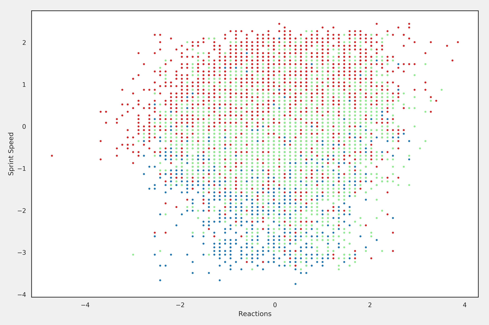
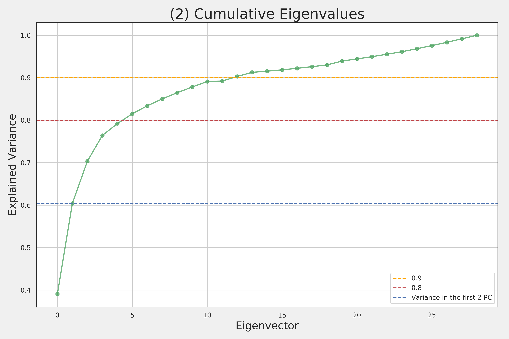
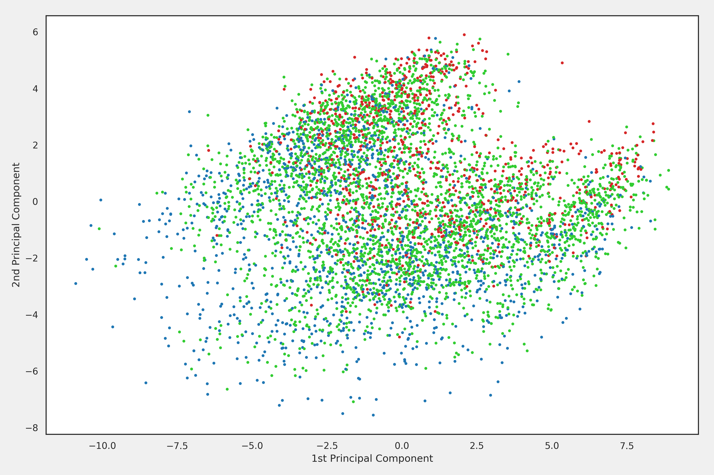

# Data Analysis of High-dimensional Football Player Attributes

​                                                                               Zhangda Xu

## **1**	Introduction

​		I have chosen to use the FIFA 19 complete player dataset which is an scraped data set from an [online FIFA database](https://sofifa.com/). It contains the basic information and rated attributes of all available football players in FIFA 19, which is a simulation game of football-related events in the top leagues worldwide. The collection and quantisation of the artificial dataset are strictly subject to the performance of individuals and advanced aspects of sports statistics in the real world. Thus given the difficulty of collecting real data, the analysis of this data set can be extrapolated to that of real-world football players.

​		This report is intended to investigate the individual attribute ratings of football players and how they contribute to differentiate categories of players. The target classes include age, position and potential of players. Specifically, the following hypothesis will be tested by the data only, whose results will be visualised:

1. Players in different roles in the game have significant differences in attributes.
2. Players who show great potential have something special with their current attributes.
3. Alternatives for a certain player can be found by investigating this data set.

​		PCA is the main approach in this analysis of high dimensional data. Principal component analysis is a statistical procedure for the purpose of finding the direction of maximum variance in the data. PCA can be done by applying eigenvalue decomposition on the covariance matrix $C$ of dataset $X$,
$$
C=UDU^T
$$
where $C$ should be normalised in advance. The result returns a diagonal matrix $D$ with non-negative eigenvalue, and an orthogonal matrix $U$ consisting columns of eigenvectors in directions of maximum variance.  The sorted principal components in matrix $D$ represent the variance in the data structure on different dimensions in descend order. By projecting the original data to the most important $PC$s, we can reduce the dimension in the original data while preserving most variances. The composition of eigenvectors linked to principal components can also tell how the new basis are formed.

​		A cluster analysis after applying PCA on the dataset can discover the similarity between points. K-means is the simplest and maybe currently most popular algorithm to use for clustering data into specified number of clusters. The algorithm starts by randomly initiating $n$ cluster centroids in the space. Then it iterates on assigning points to the closest centroid and updating the centroids by the mean of the data assigned to them respectively. K-means ends when a minimum of distortion is achieved within the dataset, which essentially ensures that most of the points are correctly assigned to the closest centroids. 

## **2**	Pre-processing

​		The dataset is first read into a DataFrame structure by the Pandas module. By default, it consists of basic information, attributes and rating of players. The  useless information are first trimmed down from the dataset. We then check if there is any missing values left in the data to avoid invalid entries. Players with none attribute are found and removed, while other single null values are replaced by the mean of this variable. 

​		The categorical variables of players are separated from the table for labelling different classes. Player value, wages and ratings are also omitted from the data since they possess generative features of all other variables. By looking into the distribution of feature 'overall rating', we can say the players from this dataset are generally normally distributed.

|  |
| :----------------------------------------------------------: |
|               *Fig 1: Player overall ratings*                |

​		Only numerical attributes of players are selected for later analysis. We delete all goalkeepers and goalkeeping attributes from the dataset because there are no significant variance in these variables for outfield players. At last, 29 attributes are selected as features of individuals indexed by a key 'Player ID'.

|  |
| :----------------------------------------------------------: |
|             *Fig 2: Columns of attributes data*              |

​		Although all the attributes in the data frame are rated under 100, their distributions vary in scales, which can lead to skewed results. The variables need to be normalised by their z-value to ensure they have similar scale and deviation. The box plot shows the change in distribution after standardisation.

|  |
| :----------------------------------------------------------: |
|  |
| *Fig 3. Attributes distribution before and after normalisation* |

## **3**	Players by Positions

​		The first hypothesis to test using the dataset is that players in different positions in the game have significant differences in attributes. Every player in the dataset comes with a categorical label indicating his main position on the pitch, e.g. 'LW' for left winger, 'CM' for centre midfield. From my prior knowledge of football, players are generally classified into 3 groups: forwards, midfielders and defenders. For better illustration, we use this convention to replace the labels with their general classes in the first experiment.  One can expect forwards and defenders will show strength in attacking and defending skills respectively, while midfielders are comprehensive in strong control of football. 

|  |
| :----------------------------------------------------------: |
|               *Fig 4. Positions on the pitch*                |

​		Given the fact that visualisation of 29 dimensions in the data is unfeasible, it is better to express the greatest amount of variance in a lower dimension. Intuitively, we can select the 2-D subspace which represent the most variance and project the high-dimensional data to axis. 

​		The first attempt is to project the data onto two defensive attributes: interception and sliding tackle. Defensive players tend to have better skills in both area than the offensive-minded. As shown in the first figure, two attributes have a positive correlation. The forwards are well grouped  near the origin because it is not their job to stop the opposites. The midfielders and defenders are not clustered to different centroids as expected. Instead, they are mixed along the line, which also suggest variance in the orthogonal direction. 

|  |
| :----------------------------------------------------------: |
|              *Fig 5. Projection on defensives*               |

​		

The second projection is to differentiate players using their agility. The result shows little correlation between reactions and sprint speed. The players are mixed in a blob with a blur structure of layers, where the forwards are generally faster than the defenders. We can conclude that projection I is better in visualising the classes of the players, but neither of them include enough variance  in the data.

|  |
| :----------------------------------------------------------: |
|               *Fig 6. Projection on agilities*               |

​		A more efficient approach is to first find the principal components of the data. Intuitively, the most important PCs are capable of preserving most amount of variance by assigning new basis in the direction of maximum variation to the original data. Specifically, we apply eigenvalue decomposition on the covariance matrix of data. The resulting eigenvectors are then truncated where only the two with largest eigenvalues are used for visualisation. Using the categorised label, three categories of players are plotted in the figure. Albeit the interlace between different colours, it is clear to see three ecliptic clusters of points emerged side by side. The defenders in blue and forwards in red are clearly separated by the principal components, where few anomalies appeared in the other cluster. The midfielders are distributed more sparsely in the middle, sharing borders with the other two classes. The fact three clusters are parallel aligned indicates that they are different with each other in the same portion of attributes.  In other words, the midfielders can always be considered as the midst choice between a pair of forward and defender. The hypothesis is verified that players in each class can be separated by their attributes.

|  |
| :----------------------------------------------------------: |
|    *Fig 7. Three-class position labelled PCA projection*     |
| Blue &rarr; **DEF**    Green &rarr; **MID**    Red &rarr; **FWD** |

​		After clear inspection, we find an unexpected forth cluster  between the defenders and midfielders. A flat cluster of defenders is distorted from the main cluster, showing its own spikes amid the midfielders. One suspect this class of players are not only doing defensive jobs but also have contribution to the team offence which cannot be neglected. For the purpose of exploration, the labels are updated by specially categorising fullbacks as 'WIDE' players. The new visualisation in the figure shows a new cluster in purple which are closer to the forwards than full-time defenders. We can deduce they share a portion of similar attributes with midfielders as well. The shape of the cluster of wide players are slightly tilted with respect to the others, indicating variance in different dimensions. The data shows that modern fullbacks and wing backs have different specialities with full-time defenders. They shares some attributes with midfielders, but specialise in a different portion of skills.

|  |
| :----------------------------------------------------------: |
|     *Fig 8. Four-class position labelled PC projection*      |
| Blue &rarr; **DEF**    Green &rarr; **MID**    Red &rarr; **FWD**    Purple &rarr; **WIDE** |

​		We also attempt to partition the midfielders into different classes. The resulting figure shows that some of the midfielders are playing just like defenders or forwards. Due to the complex roles midfielders played in a team, we cannot reduce the sparsity of the cluster by only changing the labels. We can inference that the data could fail to represent some attributes which are unique for midfielders.

​		To verify the effectiveness of PCA, we plot the corresponding eigenvalues of principal components. **[Fig.10, 11]** It shows that the first two principal components can effectively explain 60% of total variance. The top five eigenvalues are relatively large in magnitude, while the rest fluctuate around zero. By using the top five principal components, we can successfully represent about 80% of the data variance in a lower dimension.

|  |
| :----------------------------------------------------------: |
|                 *Fig 9. Eigenvalue spectrum*                 |

|  |
| :----------------------------------------------------------: |
|               *Fig 10. Cumulative eigenvalues*               |

​		A more detailed analysis can be achieved by inspecting the eigenvectors of top principal components. Since the eigenvectors are essentially new basis of the data that maximises the variance, we can check the magnitude in different dimensions and find the weights of contribution to the principal components respectively. The correlated in the first two principal components are illustrated in the bar chart.

|  |
| :----------------------------------------------------------: |
|              *Fig 11. Eigenvector Composition*               |

​		By comparing the magnitude in the direction of attributes, the first principal component represents most variance in the mental and dribbling attributes, including vision, positioning, ball control and dribbling. Some shooting attributes have large weights too. The attacking players tend to have these advantages over the defenders. The second principal component is dominated by defending skills like marking and tackle. Some physical attributes which can help get the ball in control are valued well too. It is also believed that variation with respect to shooting and and speed could be in the principal components followed. In conclusion, by using the most important two principal components about the mentality-related controlling skills and physics-related defending skills, we can effectively classify players in different positions in 2-D visualisation.

## **4**	Promising Players

​		The second hypothesis is that we can find promising young players by some special pattern in their attributes. To investigate this question, a subset of players under 22 are selected to compare promising and ordinary youngsters. The labels are categorised into three intervals by the potential growth of the players. Namely, talents are marked in red, players with less potential growth are marked in green and blue. 

​		This visualisation in the figure is not as clear as ones in the last session. By comparing with the figure which illustrates the growth of players in the total population, it is certain that fig.13 explained more details at the upper-left tail of the distribution in fig.14. Although the fig.14 compares all players in the dataset, it includes other factors with to the growth of players, such as their age. Gradually, players are getting closer to their potential in their 20s, and reach the peak at about 30. This is not sufficient to inference the hypothesis.

|  |
| :----------------------------------------------------------: |
|      *Fig 12. Youngsters growth labelled PC projection*      |
| Blue &rarr; **LOW**    Green &rarr; **MID**    Red &rarr; **TALENT** |

|  |
| :----------------------------------------------------------: |
|           *Fig 13. Growth labelled PC projection*            |
| Blue &rarr; **TALENT**    Green &rarr; **MID**    Red &rarr; **VETERAN** |

Nevertheless, the fig.13 visualising only young players shows a difference in talents and normal youngsters in the orthogonal direction. Talents are clustered into a small area at the upper-right corner, while the others are sparsely distributed. We can deduce that having advantages in certain attributes (similar to ones in the position analysis) are necessary but insufficient to become a talented player. That something special on talents are not fully represented by the data.

### V. Alternative Players

The last part of this report is to discuss  clustering and neighbour-based methods applied on the players dataset. The goal is to find alternatives of a player that share similar attributes by searching in the neighbourhood. It is useful when club managers want to keep the team competitive after a player transfer or injury. Due to the 'Curse of Dimensionality', the distance metrics become less useful in high-dimensional space. With the previous process of PCA, we can easily reduce the dimension of original data by projecting it onto the first principal components that represent most variance. We find that the data can be reduced to 5 dimensions with 80% variance preserved. This PCA projection is not used for visualisation, instead for data quantisation. 

For the attribute dataset $X$, we apply dot production with the first five principal components. The resulting matrix $X_{pca}$, with a shape of $(len(X), 5)$, is used to calculate the nearest neighbours. A distance metric of Minkowski with neighbour radius of 0.4 is set for the method. This unsupervised method ensures to return five indices of alternatives which are most similar to the input. Eventually, a list of five alternatives are computed for every player. (Detail see code.)

Another method is to apply K-means to the 5 dimension player attribute dataset. An 'elbow' test is conducted to determine the best number of clusters by the cluster inertia. It is shown that the performance of K-means starts to platen when partitioning into 5 clusters. **[fig.17]** To find the alternatives of a player, we search in the cluster that he is assigned to, then choose the best solution in this cluster.

|                   |
| :----------------------------------------------------------: |
| *F1g 14. Selecting number of clusters by finding elbow point* |

|  |
| :-------------------------------------------: |
|   *Fig 15. Kmeans clustering PC projection*   |

### VI. Conclusion

This report completes three tasks of data analysis on the FIFA19 player dataset. Using principal component analysis, we conclude that players played in different positions in the game have significant differences in their attributes. By visualising the principal components of the data, we propose that modern fullbacks make more contribution to the offences, giving them a distinguished role than traditional defenders in the team-play. The second analysis points out the missing attributes that the data fail to represent, especially for talented youngsters. This report provide two methods to find alternatives to a certain player by analysing his attributes. 