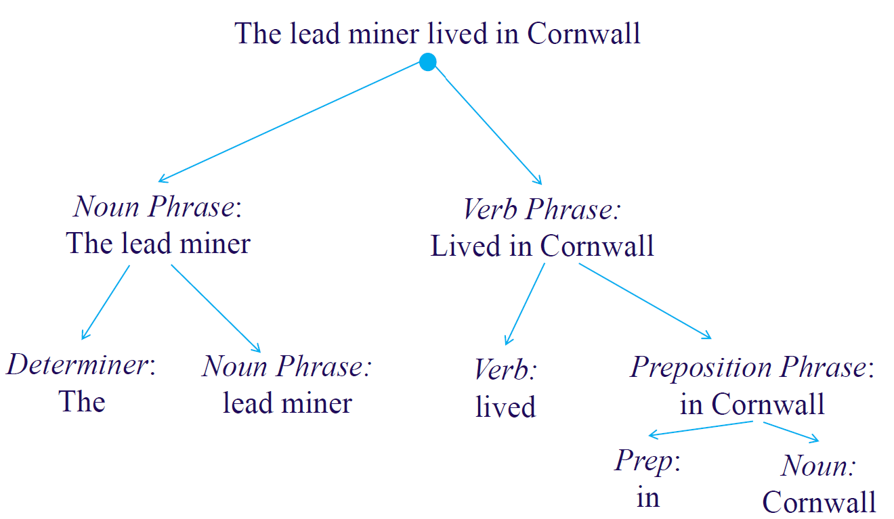

# Intelligent Data Analysis

------

## Lecture 2 : Statistical Analysis of Texts

### 0. Example Text

> There was no possibility of taking a walk that day. We had been wandering, indeed, in the leafless shrubbery an hour in the morning; but since dinner (Mrs. Reed, when there was no company, dined early) the cold winter wind had brought with it clouds so sombre, and a rain so penetrating, that further out-door exercise was now out of the question.”

​																							-- Charlotte Brontë, “Jane Eyre”, first paragraph

0

### 1. Jane Eyre Extract

- What is it **about**
- **Strategy** for understanding the text
- **Component** topics
  - Exercise (walk, wandering, exercise)
  - Gardens (shrubbery)
  - Weather (cold, winter, wind)

### 2. Structure in Text

- Words

  - **Keywords** (more important than others)
  - *There*, *and* and *that* are not important

- Sentences (Grammar/ Syntax)

  - Word sequence structure helps us to understand and to remove ambiguity

  - 'Parts of speech' - different **roles**

    *– The <u>lead</u> miner lived in Cornwall*.
    *– Keep that dog on a <u>lead</u>!*
    *– He won the <u>lead</u> role in the new film*.
    
    

​																	*Fig 1. Decomposition of the word structure*

### 3. Knowledge (Rationalism)

- Try to copy human language processing - *emulation*
- Two questions:
  1. Do we understand **sufficiently** well how we do it?
  2. Is our knowledge '**computationally useful**'?  'solid' ?
- Belong to NLP and Computational Linguistics

### 4. Available Knowledge

- Word inventories - dictionaries

- Word forms - noun, verb

- Word meanings - expressed predicate logic

- Grammar / syntax - grammatical rules

- **Parsers**

  - Apply grammatical rules to a word sequence to determine 

    if it is grammatical and, if so, its grammatical structure.

### 5. Natural Language Processing

- Use word sense, meaning and grammatical structure to infer '*meaning*'
- Several problems:
  - **Accommodating** grammar - accept non-grammatical sentences
  - **Restrictive** grammar - reject valid sentences
  - The **number of interpretations** of a simple sentence
- Language is **dynamic and changing**

### 6. Data (Empiricism)

- Use **large** corpora of text instead of human knowledge
- Use **machine learning** to identify important structure and relationships
- **Quantify** the problem
- Rely on **quantities which can be measured** from corpora rather than human opinion
- Examples:
  - Define how *useful* each word is for IR
  - Algorithms to find the *most useful* words
  - Measures of the *similarity*

### 7. Knowledge vs. Data

- Need sophisticated **computationally useful** models of language and semantics to infer meaning
- *Rational* approaches accommodate complex structure but may be fragile and **hard to generalise**
- *ML* is conceptually simpler, models are potentially huge, trained automatically
- NLP currently outperformed in most applications by ML 
  - – “Deep Learning”, “Deep Neural Networks"
- **Bundles of Words** approach to language processing

### 8. Bundles of Words

- Tokens - things separated by white space
  - Hyphenation
    - database = data-base?
  - Case (*ignore*)
    - "the brown house" vs "the Brown house"
  - Morphology
    - retrieval, retrieve, retrieved, retrieving, ...
  - Punctuation ( *ignore*)
    - "the 'honest' politician" vs "the honest politician"

### 9. Analysis of Word Frequency

​	`zipf.c` - ANSII C program for simple analysis of texts

1. **Find ** the set of different tokens in the text

2. **Count** how many times each word occurs

3. **Order** words according to the number of times occurred (**rank**)

4. Print out the result, and store **results** in a file `results`

### 10. Zipf's Law

​		- George Kingsley Zipf (1902 -1950)

- For each word $w$, let $F(w)$ be the number of times $w$ occurs in the corpus

- Sort the words according to frequency

- The word's rank-frequency distribution will be fitted closely by:
  $$
  F(r) = \frac{C}{r^\alpha}, where \ \alpha \approx 1, C \approx 0.1\\
  $$
  Therefore,

$$
log(F(r)) = log(C) - \alpha log(r)
$$

- On a log-log scale, Zipf's law predicts a **straight-line** relationship between log-rank and log-frequency, where $\alpha$ is the **slope** of the line and $C$ is the **intersection** with the vertical axis.

- This provides a way to estimate $C$ and $\alpha$

  

​																*Fig 2. Log-log plot – Alice in Wonderland*

### 11. Why does Zipf's Law work?

- Zipf's Law appears to reflect a number of factors:

  - The requirements of human to communicate
    - Use as little effort as possible to communicate a message

  - Basic combinatorics
  - The requirement of grammar for simple 'glue' words
  - Author and topic vocabularies

- Zipf's Law also works on other real-life numerical data

  

[^Benford's Law]: Benford's law, is an observation about the frequency distribution of leading digits in many real-life sets of numerical data. The law states that in many naturally occurring collections of numbers, the leading significant digit is likely to be small.

