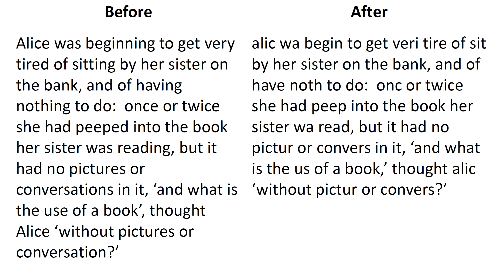

# Intelligent Data Analysis

---

## Lecture 3 : Stopping, Stemming & TF-IDF Similarity

### 1. Text Pre-processing

- Stop word removal: Simple techniques to remove 'noise words' from texts
  - Remove common '**noise words**' which contribute no information to IR

- Stemming: Remove **irrelevant differences** from different 'versions' of the same word
  - Identify different **forms** of the same word with a common stem

- (Later) Exploit semantic relationships between words
  - If two words have the same meaning, treat them as the same word

### 2. Stemming (morphology)

- Basic idea: If a query and document contain different forms of the same word, then they are *related*.
- Remove **surface markings** from words to reveal their basic form:
  - forms &rarr; form, forming &rarr; form
  - formed &rarr; form, former &rarr; form
    - "form" as the **stem** for listed words

- Replaces tokens (words) with **equivalence classes** of tokens - **stems**

  - Reduces the number of different words in a corpus

  - Increases the number of instances of each token

    

​																*Fig 1. 'Resolving power' of the word*

### 3. Stemmers

- Not all words obey simple, regular rules:
  - running &rarr; run
  - women &rarr; woman
  - leaves &rarr; leaf
  - ferries &rarr; ferry
  - alumnus &rarr; alumni
  - datum &rarr; data
- Common solution is to identify **sub-pattern of letters** within words and devise **rules** for dealing with these patterns

- A *stemmer* is a piece of software which implements a stemming algorithm
- **Porter stemmer**: a standard stemmer as a free download
  - Implements a set of about 60 rules
  - Typically reduces vocabulary size by 10% to 50%

​				*Fig 2. Example of applying stemmer to the first paragraph from 'Alice in Wonderland'*

### 4. Stop Lists

- In IR, 'noise words' are often referred to as **Stop Words**

- Stop words are simply specified to the system in a text file: the **Stop List**

- Typically consist of the most common words from large corpus

- `stop.c`

  1. Reads in a stop list file (*text file, one word per line*)

  2. Stores stop words in `char **stopList`

  3. Read text file **one word at a time**

  4. Compares each word with each stop word

     &rarr;   Prints out words not in stop list

- `stop stopListFile textFile > opFile`

### 5. Simple Text Retrieval

- Given two documents, $d1$ and $d2$, assume that:
  - All of the *stop words* have been removed
  - *Stemming* has been applied

- We want to know if $d1$ and $d2$ are 'about' the same thing
  - Calculate the **similarity** between $d1$ and $d2$
- The simplest approach - **TF-IDF similarity**

### 6. Matching

- Given a query $q$ and a document $d$, we want to define a number:
  $$
  Sim(q,d)
  $$
  which defines the similarity between $q$ and $d$

- Given the query $q$ we return list of documents $d_1, d_2, ..., d_N$ such that:

  - $d_1$ is the document for which $Sim(q,d)$ is **biggest**
  - $d2$ is the next biggest value of $Sim(q,d)$
  - etc &darr;

### 7. Similarity

- The **similarity** between $q$ and $d$ will depend on the **number of terms** which are common to $q$ and $d$
- We also need to know how **useful** each common term is for discriminating between different documents.
- For example,
  - it is not significant if $q$ and $d$ share *"the"*
  - but it may be significant if they share *"magnesium"*

### 8. IDF Weighting

- Popular measure of the **significance** of a term for **discriminating** between documents - **Inverse Document Frequency**

- For a token $t$ define:
  $$
  IDF(t) = ln(\frac {ND} {ND_t})
  $$

  - $ND$ is total number of documents in the corpus
  - $ND_t$ is number of those documents that **include $t$**

- Case 1: $t$ occurs in equally often in all documents
  
  - $ND$ = $ND_t$ &rarr; $IDF(t) = 0$
- Case 2: $t$ occurs in just a few documents
  
  - $ND > ND_t$ &rarr; $IDF(t) > 0$
- IDF **ignores how often** term $t$ occurs in a document

### 9. Effect of Document Length

- Suppose query $q$ consists **only** of term $t$
- Suppose document $d_1$ also consists **only** of $t$
  - Number of shared terms is 1
  - Match 'perfectly'
- Suppose document $d2$ has 100 terms, including $t$
  - Number of shared terms is 1
  - But in this case **co-occurrence** of $t$ is *less significant*

### 10. TF-IDF Weight

- Let $t$ be a term and $d$ a document

- TF-IDF &rarr; Term Frequency - Inverse Document Frequency

- The TF-IDF **weight** $W_{td}$ of term $t$ for document $d$ is:
  $$
  W_{td} = f_{td}.IDF(t)
  $$
  where $f_{td}$ is the **term frequency** - the number of times $t$ occurs in $d$

- For $W_{td}$ &uarr;: 
  - $f_{td}$ &uarr; - $t$ must occur often in $d$
  - $IDF(t)$ &uarr; :
    - $ND_t$ &darr; - $t$ must only occur in relatively few documents

### 11. Query Weights

- Suppose $t$ is a term and $q$ is a query

- If $q$ is a **long** query, can treat $q$ as a document:
  $$
  W_{tq} = F_{tq}.IDF(t)
  $$

	where $f_{tq}$ is the *query term frequency*

- If $q$ is a **short** query, define the TF-IDF weight as:
  $$
  W_{tq} = IDF(t)
  $$

  [^short query]: $F_{tq}$ is ignored here if *term frequency* is small.

### 12. TF-IDF Similarity

- Define the similarity between query $q$ and document $d$ as:
  $$
  Sim(q,d) = \frac {\sum\limits_{t \in qd} {W_{td}\cdot W_{tq}} }{{||d||}\cdot{||q||}}
  $$
  