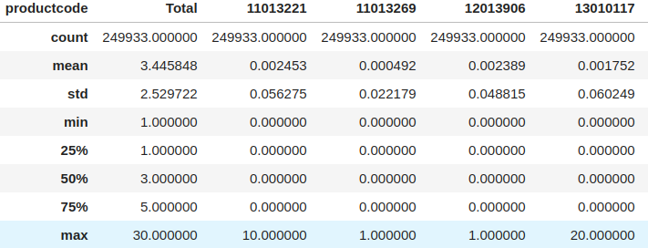
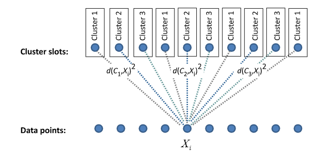
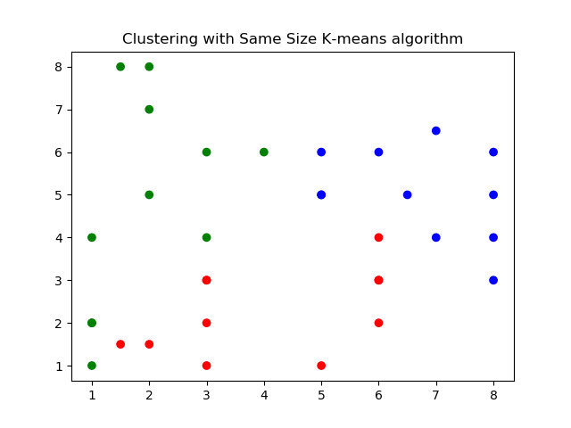
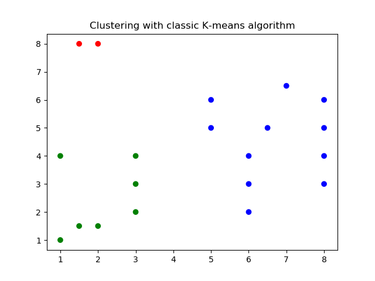
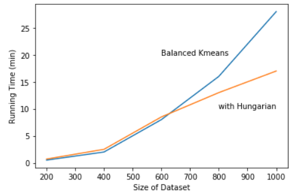

## Second Semester Mini-project

# Solving An Work Order Allocation Problem with Balanced K-Means Clustering

### Author

## Zhangda Xu

### Supervisor

## Peter Tino

### School of Computer Science, University of Birmingham

### April 18, 2020

# Table of Contents

### I. Introduction

### II. Problem

	1. Formation
 	2. Data set

### III. Methods

1. Related topics
2. Data processing
3. K-means
4. Balanced K-means
5. Balanced K-means with Hungarian algorithm

### IV. Experiment

### V. Conclusion

### VI. References

#### Appendix B. Statement of information search strategy

# List of Figures

Fig 1. Statistics of the data set

Fig 2. Eigenvalues of Sparse PCA

Fig 3. Assigning points into cluster slots

Fig 4-1. Clustering with same-size K-means

Fig 4-2. Clustering with classic K-means

Fig 5. Run time of both methods of balanced K-means

# Solving An Work Order Allocation Problem with Balanced K-Means Clustering

### Abstract

Generally, we categorise machine learning applications into three paradigms: supervised learning, unsupervised learning and reinforcement learning. In practical applications, we are often provided with insufficient information or unlabelled data, where unsupervised learning approaches have advantages. This paper faces the problem in a logistic factory of allocating orders onto assembly lines to facilitate the production. We present a solution to this real-world problem by applying a balanced K-means algorithm which guarantees to return same-size clusters. Two different methods of assignment in the algorithm are tested in the experiment. The result shows that proposed balanced K-means algorithm can, at certain scale, solve the allocation problem. The performance of the algorithm is promising compared with traditional approaches.

**Keywords:**  K-means, same-sized clustering, balanced clustering, logistics, operations research

# I. Introduction

Recent improvements in data analysis methods have brought machine learning to applications in a wide range of industries, including chemistry, biogenetics, operations research, etc. Generally, we categorise machine learning applications into three paradigms: supervised learning, unsupervised learning and reinforcement learning. Among them, supervised learning and reinforcement learning approaches rely on labels and environmental data as prior knowledge to generate a robust model of estimation. However, in practical applications, we are often provided with insufficient information or unlabelled data, which require human efforts to identify or verify. Unsupervised approaches can learn intrinsic structures of the unlabelled data set by only inspecting the relationship of the properties of each data. In a real world application, a peek into the data set by unsupervised learning is often sufficient to make better decisions and predictions than humans.

Clustering is a widely used unsupervised learning technique in the application of exploratory data mining. The goal of clustering is to find a partition of the original data, where data within the same cluster or statistical distribution are similar to each other but all different from those in other clusters. The most notable approaches include K-means clustering, agglomerate clustering and Gaussian mixtures, etc. [17] Being implemented in many algorithms, the clustering analysis task itself is often formulated as a multi-objective optimisation, which generally optimises over the goal of finding similar data points in the same cluster and differentiating between different clusters. [14]

K-Means clustering is one of the most popular clustering approaches in the application for its simple heuristic and wide effectiveness. It was first introduced by Steinhaus (1956) and popularised by MacQueen (1967). [9] It particularly minimises the sum of the within-cluster squared Euclidean distance by iteratively assigning centroids to clusters and modify them according to the mean value of points in the cluster. The number of clusters needs to be predefined before iteration, which is not obvious in some scenarios. Another drawback of K-Means clustering is that a random initiation of cluster centroids at the start can lead to a completely different partition of data, which then requires multiple runs of the algorithm to find the preferred solution. Being this case, K-Means clustering is not ensured to find the global optimum of the task, as in each iteration, it always seeks for a smaller within-cluster variance and cannot escape from a local minimum eventually. 

This project is intended to solve a machine learning application problem in logistic industry, which needs to automatically allocate a similar amount of orders with different products onto each assembly line to optimise the daily throughput. We propose a variation of K-Means algorithm with a balanced constraint to solve the specific problem with data processing methods in advance. The algorithm is then compared with vanilla K-Means and other heuristic algorithms in terms of clustering results and scalability. To validate the wide effectiveness of similar problems, the algorithms are also tested on other random data sets. The result shows that our solution has an edge over existing algorithms, which cannot completely fulfill the purpose.

The rest of the paper is organised as follows: In Section 2, we introduce the problem and the data set. Related literature to the paper is reviewed in Section 3. Section 4 illustrates the essential data pre-processing methods taken in advance, and then formalise the balanced K-Means algorithm with other methods used for comparison. The results of the experiments are presented and discussed in Section 5.

# II. Problem 

We present the original optimisation problem in the following scenario. A logistic factory is designated as the transfer hub of canned drinks of the local region. It is responsible for recycling excess inventory from groceries,  repackaging batches of drinks and dispatching the ordered packages back to the local shops. The factory receives about 30,000 orders daily on average, which are all required to be same day delivery. More specifically, the orders are consisted of about 170 categories of products. The packaging operations in the factory are conveyed on 4 assembly lines, which make requests to the storage according to the order and package them. Although a huge two-floor storage is built next to the operation workshop, the automatic assembly lines can easily be overloaded by the mass amount of orders and vast compositions of different products. This can lead to increased maintenance cost and human effort to optimise the allocation of orders.

To facilitate the packaging process and increase the daily throughput in the factory, a clustering approach is required to efficiently partition the orders onto packaging lines. Due to the fact that each line has limited access to the stock, it is easy to see that distributing orders with similar composition onto the same line can reduce the slack of time in the process of product collection and transportation. Based on the assumption of equivalent processing time of each order regardless of its size, we can deduce that balancing the number of orders on each production line is the most efficient way of order allocation. The analysis of this problem suggests a clustering method which is capable of partitioning a group of data into same-size clusters. The sections below will follow this rationale to discuss the solution to the problem.

### Data

To solve the problem, a statistical analysis of the order data is required. This problem emerges as an unsolved customer need in a data processing company that provided the raw database of daily orders to the author. Usage of the data is made available for research purposes. For every order in recent 3 months, all the product entries are recorded by row in the time series database. Since orders are best described by their composition of products, product logs belong to the same order should be considered as a whole. Thus the first step is to reshape the grouped product history data into entries of orders with quantities of different products as multi-dimensional features. The resulted table of the data consists of orders as rows with quantities of 169 products as columns. The numbers of products in each order range from 1 to 30 with an average of 3.5 per order.  

|  |
| :----------------------------------------------------------: |
|              Fig 1. Statistics of the data set               |

The order partition problem then can be formulated as clustering a large number of high-dimensional sparse data points. However, high-dimensional data breaks most clustering methods due to the ‘Curse of Dimensionality’. Essentially, all the data points appear dissimilar to each other in a high-dimensional space. It prevents the convergence of the optimisation over the sum-of-squares distance criteria in K-Means since the distance between every pair of points is similarly large. The points in a single cluster can have no shared subspace structure but are grouped only because of the size constraint. The limited categories of products in each order also contribute to a sparse data set, where each entry has zeros in most columns but with few valid counts.

Dimension reduction techniques are essential to make the clustering task on this data set possible. Some manual trimming on the data can make it more feasible. We can remove the orders that only include a single type of products. These entries are not valuable for finding the clusters and can be classified as outliers near the edges of the target space. One popular way to reduce the dimensions in the data before clustering is by applying decomposition techniques like Principal Component Analysis. A random projection of high-dimensional data into a lower dimension also could work. Section 4 will discuss the processing solution in detail.

# III. Methods

### 1. Related topics

Given the general rationale of solving the problem,  the solutions must return at least similar sized clusters of the observations. A simple modification of the hierarchical clustering proposed in [39] is intended to solve the problem by iteratively split the cluster of observations with a Ward linkage criterion if the current size is larger than the designated number. Since its special structure of sub-clusters, another approach can be taken from the bottom of the hierarchy to ‘cut’ the cluster off the dendrogram if the size is desirable. However, either method can fail to return a similar-sized partition on irregular data set. In addition, hierarchical clustering is sensitive to outliers, which are abundant in the data set.

Other clustering methods are also considered as candidates to modify. [34] Dai proposed an ant colony algorithm to solve this problem as a combinatorial one. Distribution-based algorithms including Gaussian mixture assume the observations follow a specific pattern in the region, which conducts iteration using expectation-maximisation algorithm similar to K-means. They are all robust models related to distance metrics and cannot be solved with external constraints.

### 2. Data Processing

Sparse K-means algorithm solves the problem of applying K-means to high-dimensional sparse data. [32] Generally, it searches for the partition matrix $C$ and the weights $w_j$ of features $j$ that maximises the between-cluster sum of square subject to the constraints
$$
\sum\limits_{i=1}^pw_j^2\leq1 \ and \ \sum\limits_{i=1}^pw_j\leq l, \ \ 1 \leq l \leq \sqrt p.
$$
This method shows that a LASSO regularisation can reduce the sparse matrix and select useful features in the subspace. 

Since the processed data have over 160 features due to the composition of different products, the dimension reduction technique is necessary for clustering. A common tool to reduce the high-dimensional data is Principal Component Analysis, which can preserve most variances in the data even in lower dimensions. It is done by eigenvalue decomposition of a data covariance matrix. However, PCA is not useful on the sparse data set.  The linear nature of decomposition will replace most zeros in the matrix with parameters which express the variance in this feature. It can tilt the sparsity of the data

Inspired by the sparse K-means clustering, the high-dimensional data can be reduced by applying a sparse Principal Component Analysis. [11] Essentially, it maximises the variance along the direction of the data space subject to a $L0$ norm constraint. That is, for a covariance matrix of $X$, which has dimension $p \times p$:
$$
\text {max}\ \ \  v^T\Sigma v \\
\text {subject to} \ \Vert v \Vert_0 \leq k, \ \ 1\leq k \leq p
$$
where $v$ is the unit vector on the direction of max variance. By inspecting the eigenvalue, the first 5 components are chosen to be the reduced data.

|  |
| :----------------------------------------------------------: |
|               Fig 2. Eigenvalues of Sparse PCA               |

### 3. K-means

The K-means clustering is a NP-hard algorithm by default. [14] It can be formulated in the following process. Given a data set $D$ including $n$ points in $\mathbb R^n$ and the initiated $K$ cluster centroids of $m^{1,i},m^{2,i},..., m^{k,i}$, the classical K-Means clustering algorithm computes clusters $C^{1,i+1},C^{2,i+1},..., C^{k,i+1}$ at the next iteration by repeating 2 steps:

1. **Assignment.** For all the data points $x^i \in D$, assign $x^i$ to the cluster $C^{j,i}$ which has closest centroid $m^{j,i}$ to $x_i$.
2. **Update.** Compute the new cluster centre $m^{1,i+1},m^{2,i+1},..., m^{k,i+1}$ according to the mean value of all the points in each cluster.

The iteration stops when the assignment of each point does not change anymore. Otherwise, the iterator $i$ is incremented by 1 and return to step 1.

The K-means clustering essentially seeks for a partition on the original $n$ points into $K$ clusters, such that the within-cluster sum of squares (WCSS) 
$$
\sum\limits_{k=1}^{K} \frac{1}{n_k}\sum\limits_{i, i' \in C_k}\sum\limits_{j=1}^p d_{i,i',j}
$$
is minimised, where $n_k$ is the cardinality of the cluster $k$, $p$ is the number of features in the $n$ points. In this paper, the sum of the distance along all the dimensions $d_{i,i’, j}$ denotes the Euclidean distance between any 2 points, as $(X_{ij} - X_{i'j})^2$. 

Although K-means tends to return similar sized clusters of observations according to the Voronoi diagram, it is not often the case when the distribution of the clusters is not uniform. Due to the special properties of the data in this problem, the classical K-means cannot perform the partition required on the observations without adding external constraints. It is set as the control group in the experiment to distinguish the implemented algorithms.

Several variations of the K-means algorithm proposed methods to control the number of observations in each cluster. Bradley first proposed an approach to combine the size constraints with K-means clustering to avoid empty clusters or clusters with few points. [9] It introduces a constraint of a minimum number of data points $\tau$ in a cluster and the assignment sub-problem is solved by simplex algorithms. The results of the algorithm surprisingly perform better than the original K-means in some conditions, where the constraint helps to escape from local optimum. This explains the feasibility and flexibility of constrained K-means.

Most of the balanced clustering algorithms can be formulated as a two-objective optimisation problem, which aims to minimise the within-cluster sum of square distance and to balance the clusters. The former as an individual task is an implementation of K-means clustering, while the latter is also a trivial task simply to partition the data points into quotients of the total number. Nevertheless, in many existing cases, the optimisation process is a compromise between both objectives. 

As demonstrated in the last section, this paper is intended to formulate balance-constrained clustering approaches, where the same-size requirement is mandatory. The resulting partition of the algorithm should guarantee the balance size of all clusters. It is a simpler heuristic because a match of the partition matrix can be tested, while the minimisation of the WCSS can never be evaluated as a termination. Thus the WCSS is used for comparing the performance and effectiveness of clustering approaches.

### 4. Balanced K-means

We propose a modified K-means clustering algorithm which iteratively modifies the members of clusters by checking the possible movements of observations that both decrease the WCSS criteria and satisfy the size constraint. In the context of the implemented approach, the algorithm first initiates the clusters and centroids as the classic K-means algorithm. In addition, each cluster is pre-assigned with $floor(n/K)$ slots, where the observations can only be allocated. This sets a hard constraint on the size of all clusters.

An sorted list of observations $L$ in each cluster is created to easily identify the least fit members compared with other clusters. The Delta $\Delta$ of the pairwise distance between the current assignment of the data point and the best alternative assignment is used as the metric. In the case of a cluster with exceeding number of observations, the leavers are selected by ascending priority according to the list. A swap will be conducted if there exist multiple leavers and the swap would yield a decrease on WCSS. The observations will be reassigned or removed to fit the constraint. The new centroids are calculated as the means of the data points assigned to each cluster:
$$
C_i^{(t+1)}=\frac 1 {n_i}\sum\limits_{X_j \in C_i^{(t)}}X_j
$$
where $n_i$ indicates the number of observations in the cluster. The algorithm converges when no better changes or iteration times reach the limit. The pseudo-code of this implementation is listed below. 

---

**Algorithm 1. Balanced K-means algorithm**

Input: data set $X$, number of clusters $k$

Output: partition of data set

​	Initialise centroid locations $m^0$.

​	Calculate cluster size $floor(n/k)$.

​	Create sorted list of data $L_k$ in each cluster. 

​	t $\leftarrow$ 0

​	**repeat**

​		Assignment step:

​					Calculate distance to each cluster $C_k$.

​					Assign data points to closest centroid.

​					**if** size(i) > $floor(n/k)$:

​							drop point $L_i[-1]$.

​							**if **size(j) > $floor(n/k)$:

​							swap points assignment $L_i[-1], L_j[-1]$ .

​		Update step:

​					Calculate new centroid locations $C^{t+1}$

​		t $\leftarrow$ $t + 1$

​	**until** centroids do not change.

​	Output partition.

---

Since the introduction of a new sorted list of the original clustering partition, the iteration is expected to be slower than the classic K-means. However, the implementation works directly on a Python *DataFrame* structure, which improves the computation when dealing with high-dimensional data. The extra space usage is trivial.

### 5. Balanced K-means with Hungarian Algorithm

We implement another solution called Balanced K-means to the problem which is first proposed in [14]. This variation uses the Hungarian algorithm to solve the cluster reassignment sub-problem, which is logically determined in our method. At the initiation stage, the $K$ centroids of clusters $m^{1,1},m^{2,1},..., m^{k,1}$are randomly chosen from the data points. Then the $floor(n/K)$ cluster slots in each cluster are partitioned by the centroids and are assigned to all the clusters by Hungarian algorithm, which can efficiently assign $n$ data points to $K$ clusters in polynomial time. The weight of assigning data point $X_i$ to clusters $C^{1,i},C^{2,i},..., C^{k,i}$ are the Euclidean distance to the centroids in each cluster, respectively. After updating the new centroids of clusters, the edge weights are also updated by
$$
W(a,i) = dist(X_i, C_{(a mod k)+1)}^t)^2
$$
where $a$ denotes the number of cluster slots. The algorithm converges when the centroids stop moving. Due to the same condition of nonincreasing WCSS at each update step, the algorithm will return a local optimal partition of the original data.

|  |
| :----------------------------------------------------------: |
|       Fig 3. Assigning points into cluster slots [14]        |

---

**Algorithm 2. Balanced K-means with Hungarian algorithm**

Input: data set $X$, number of clusters $k$

Output: partition of data set

​	Initialise centroid locations $m^0$.

​	t $\leftarrow$ 0

​	**repeat**

​		Assignment step:

​					Calculate edge weights.

​					Solve assignment problem using Hungarian.

​		Update step:

​					Calculate new centroid locations $C^{t+1}$

​		t $\leftarrow$ $t + 1$

​	**until** centroids do not change.

​	Output partition.

---

​		

# IV. Experiment

In the first experiment, an artificial 2-D data set of 30 observations are generated in 3 clusters to show the different clustering results from the proposed balanced K-means algorithm and classic K-means. By choosing $K$ as 3, balanced K-means returns 3 clusters with 10 data points in each cluster, while the default K-means finds the true cluster structures in the space. In the context of solving the problem in this paper, balanced K-means can return acceptable clusters with the same cardinality.

|  |  |
| ------------------------------------------------------------ | ------------------------------------------------------------ |
| Fig 4-1. Clustering with same-size K-means                   | Fig 4-2. Clustering with classic K-means                     |

Both methods of balanced K-means are expected to run slower than the original K-means. To test their scalability on a large amount of data points, the order history data set provided by the factory are used to generate random samples with various observations. The selected data are then reduced by the Sparse PCA method to 5 dimensions. Two different methods are tested and compared on the selected subsets by scale. It shows that it is still not practical for the factory to cluster all the 30,000 daily orders together. An alternative method is to first inspect the clusters in a subset of the total orders, then use the fit model to predict the labels of other orders. 

|  |
| :----------------------------------------------------------: |
|     Fig 5. Run time of both methods of balanced K-means      |

The performance of the clustering is quantified by the Silhouette score, [1] which compares the mean distance to the cluster centroid $a$ and the mean distance to the nearest cluster $b$:
$$
s = \frac {b-a}{max(a,b)}
$$
Normally, values around 0 indicate overlapping clusters, while the range of value is [-1,1]. The distribution of optimisation criteria WCSS is also recorded, which is slightly higher than the original K-means. This table shows a robust performance of both methods on the problem. The Hungarian method shows a greater potential for scalability. The performance metrics with Hungarian method are listed below. The Silhouette scores of both methods are tested.

| Data size | WCSS | Mean    | Std     | Silhouette(/balanced) |
| --------- | ---- | ------- | ------- | --------------------- |
| 50        | 2.92 | 3.15    | 0.15    | 0.26 / 0.19           |
| 100       | 3.81 | 3.86    | 0.07    | 0.18/ 0.16            |
| 200       | 4.44 | 4.50    | 0.06    | 0.06/ 0.04            |
| 500       | 5.86 | 5.91    | 0.09    | -0.08/ -0.10          |
| 1000      | 7.89 | One run | One run | -0.17/ -0.26          |

# V. Conclusion

We have solved a real-world work order assignment problem by applying a balanced K-means algorithm which guarantees to return same-size clusters. Both variations of the algorithm work well on either test data or the real order data set. The experiments illustrate the impact of implementing the balanced K-means algorithm and show that it can achieve the special task with a little sacrifice on WCSS. Balanced K-means is proved feasible on large data sets with over 1000 observations. However, the clustering performance and the running time shows that it is still not practical for the factory to use directly on huge data sets. Therefore, further development of the project will focus on implementing a batched version of the clustering method, which can drastically reduce the running time.

# VI. References

1. ​	Jenatton, R., Obozinski, G., & Bach, F. (n.d.). *Structured Sparse Principal Component Analysis*.
2. ​	Rousseeuw, P. J. (1987). *Silhouettes: a graphical aid to the interpretation and validation of cluster analysis*. *Journal of Computational and Applied Mathematics* (Vol. 20).
3. ​	He, R., Xu, W., Sun, J., & Zu, B. (2009). Balanced K-means algorithm for partitioning areas in large-scale vehicle routing problem. In *3rd International Symposium on Intelligent Information Technology Application, IITA 2009* (Vol. 3, pp. 87–90). https://doi.org/10.1109/IITA.2009.307
4. ​	Kondo, Y., Salibian-Barrera, M., & Zamar, R. (2016). RSKC: An R package for a robust and sparse k-means clustering algorithm. *Journal of Statistical Software*, *72*. https://doi.org/10.18637/jss.v072.i05
5. ​	Tang, W., Yang, Y., Zeng, L., & Zhan, Y. (2019). Optimizing MSE for clustering with balanced size constraints. *Symmetry*, *11*(3). https://doi.org/10.3390/sym11030338
6. ​	Greene, D., Cunningham, P., & Mayer, R. (2008). Unsupervised learning and clustering. In *Lecture Notes in Applied and Computational Mechanics*. https://doi.org/10.1007/978-3-540-75171-7-3
7. ​	Friedman, J. H., & Meulman, J. J. (2004). Clustering objects on subsets of attributes (with discussion). *Journal of the Royal Statistical Society: Series B (Statistical Methodology)*, *66*(4), 815–849. Retrieved from http://doi.wiley.com/10.1111/j.1467-9868.2004.02059.x%5Cnpapers3://publication/doi/10.1111/j.1467-9868.2004.02059.x
8. ​	Fränti, P., & Kivijärvi, J. (2000). Randomised local search algorithm for the clustering problem. *Pattern Analysis and Applications*, *3*(4), 358–369.https://doi.org/10.1007/s100440070007
9. ​	Bradley, P., Bennett, K., & Demiriz, A. (2000). Constrained k-means clustering. Technical Report, 9. Retrieved from http://citeseerx.ist.psu.edu/viewdoc/summary?doi=10.1.1.33.3257
10. ​	Jain, A. K. (2008). Data Clustering: 50 Years Beyond K-means. Machine Learning and Knowledge Discovery in Databases, 3–4.https://doi.org/10.1007/978-3-540-87479-9_3
11. ​	Ganganath, N., Cheng, C. T., & Tse, C. K. (2014). Data clustering with cluster size constraints using a modified k-means algorithm. Proceedings - 2014 International Conference on Cyber-Enabled Distributed Computing and Knowledge Discovery, CyberC 2014, (1), 158–161. https://doi.org/10.1109/CyberC.2014.36
12. ​	Zhu, S., Wang, D., & Li, T. (2010). Data clustering with size constraints. Knowledge-Based Systems, 23(8), 883–889. https://doi.org/10.1016/j.knosys.2010.06.003
13. ​	Peikari, M., Salama, S., Nofech-Mozes, S., & Martel, A. L. (2018). A Cluster-then-label Semi-supervised Learning Approach for Pathology Image Classification. Scientific Reports, 8(1), 1–13. https://doi.org/10.1038/s41598-018-24876-0
14. ​	Malinen, M. I., & Fränti, P. (2014). Balanced k-means for clustering. Lecture Notes in Computer Science (Including Subseries Lecture Notes in Artificial Intelligence and Lecture Notes in Bioinformatics), 8621 LNCS, 32–41. https://doi.org/10.1007/978-3-662-44415-3_4
15. ​	Hoda Badr, Cindy L. Carmack, Deborah A. Kashy, Massimo Cristofanilli, and T. A. R. (2011). Sparse Logistic PCA for Binary Data. Bone, 23(1), 1–7. https://doi.org/10.1161/CIRCULATIONAHA.110.956839
16. ​	Elhamifar, E., & Vidal, R. (2013). Sparse subspace clustering: Algorithm, theory, and applications. IEEE Transactions on Pattern Analysis and Machine Intelligence, 35(11), 2765–2781. https://doi.org/10.1109/TPAMI.2013.57
17. ​	Xu, R., & Wunsch, D. (2005). Survey of clustering algorithms. IEEE Transactions on Neural Networks, 16(3), 645–678. https://doi.org/10.1109/TNN.2005.845141
18. ​	Shun, Z., Chang, F. U., Iu, L. L., & Wen, H. O. N. G. (2011). Application of Improved Size Constrains in Clustering Methods, 7–10.
19. ​	Kali, Y., & Linn, M. (2010). Reducing the Dimensionality of Data with Neural Networks. International Encyclopedia of Education, 313(July), 468–474. https://doi.org/10.1016/B978-0-08-044894-7.00081-6
20. ​	Brodinová, Š., Filzmoser, P., Ortner, T., Breiteneder, C., & Rohm, M. (2019). Robust and sparse k-means clustering for high-dimensional data. Advances in Data Analysis and Classification, 13(4), 905–932. https://doi.org/10.1007/s11634-019-00356-9
21. ​	Banerjee, A., & Ghosh, J. (2006). Scalable clustering algorithms with balancing constraints. Data Mining and Knowledge Discovery, 13(3), 365–395. https://doi.org/10.1007/s10618-006-0040-z
22. ​	Forestier, G., & Wemmert, C. (2016). Semi-supervised learning using multiple clusterings with limited labeled data. Information Sciences, 361–362, 48–65. https://doi.org/10.1016/j.ins.2016.04.040
23. ​	Trejos, J., Murillo, A., & Piza, E. (2004). Clustering by Any Colony Optimization. Classification, Clustering, and Data Mining Applications, (January). https://doi.org/10.1007/978-3-642-17103-1
24. ​	Anghelescu, A. V., & Muchnik, I. B. (2004). Combinatorial PCA and SVM methods for feature selection in learning classifications (applications to text categorization), 491–496. https://doi.org/10.1109/kimas.2003.1245090
25. ​	Wagstaff, K., Cardie, C., Rogers, S., & Schrödl, S. (2001). Constrained K-means Clustering with Background Knowledge. International Conference on Machine Learning ICML, pages, 577–584. Retrieved from http://citeseerx.ist.psu.edu/viewdoc/download?doi=10.1.1.90.4624&amp;rep=rep1&amp;type=pdf
26. ​	Van Mechelen, I., Boulesteix, A.-L., Dangl, R., Dean, N., Guyon, I., Hennig, C., … Steinley, D. (2018). Benchmarking in cluster analysis: A white paper. ArXiv, (April 2019). Retrieved from http://arxiv.org/abs/1809.10496
27. ​	Casella, G., Moreno, E., & Girón, F. J. (2014). Cluster analysis, model selection, and prior distributions on models. Bayesian Analysis (Vol. 9). https://doi.org/10.1214/14-BA869
28. ​	Du, K.-L. (2010). Clustering: A neural network approach.
29. ​	Dorigo, M., Di Caro, G., & Gambardella, L. M. (1999). Ant algorithms for discrete optimization. Artificial Life, 5(2), 137–172. https://doi.org/10.1162/106454699568728
30. ​	Buntine, W., & Jakulin, A. (2004). Applying Discrete PCA in Data Analysis. Proceedings of the Twentieth Conference on Uncertainty in Artificial Intelligence (UAI2004), 59–66. Retrieved from http://eprints.pascal-network.org/archive/00000143/
31. ​	Schein, A. I., Saul, L. K., & Ungar, L. H. (2009). A Generalized Linear Model for Principal Component Analysis of Binary Data.
32. ​	Witten, D. M., & Tibshirani, R. (2010). A framework for feature selection in clustering. Journal of the American Statistical Association, 105(490), 713–726. https://doi.org/10.1198/jasa.2010.tm09415
33. ​	Karegowda, A. G. (2013). International Journal of Advanced Research in Particle Swarm Optimization Algorithm Based k -means and Fuzzy c -means clustering, 3(7), 448–451.
34. ​	Dai, W., Liu, S., & Liang, S. (2009). An improved ant colony optimization cluster algorithm based on swarm intelligence. Journal of Software, 4(4), 299–306. https://doi.org/10.4304/jsw.4.4.299-306
35. ​	Vali, M. (2013). New Optimization Approach Using Clustering-Based Parallel Genetic Algorithm. Retrieved from https://arxiv.org/ftp/arxiv/papers/1307/1307.5667.pdf
36. ​	Chang, W., Yuan, X., & Zhou, S. (2018). Improvement of K-means clustering algorithm based on MIP optimization. Journal of Physics: Conference Series, 1053(1). https://doi.org/10.1088/1742-6596/1053/1/012100
37. ​	Höppner, F., & Klawonn, F. (2008). Clustering with size constraints. Studies in Computational Intelligence, 137, 167–180. https://doi.org/10.1007/978-3-540-79474-5_8
38. ​    ELKI Data Mining. Same-size k-Means Variation. https://elki-project.github.io/tutorial/same-size_k_means
39. ​    Hippocamplus. Clustering into same size clusters. https://jmonlong.github.io/Hippocamplus/2018/06/09/cluster-same-size/#iterative-bottom-leaves-hierarchical-clustering

### Appendix B : Statement of information search strategy

​	**Database**: Google, Google Scholar, Wikipedia, IEEE, Elsevier

​	**Search terms**: 

			1. clustering
   			2. clustering analysis
   			3. combinatorial
   			4. K-means
   			5. sparse clustering
   			6. sparsity
   			7. hierarchical clustering
   			8. Hungarian algorithm
   			9. Simplex algorithm
   			10. PCA
   			11. Sparse PCA
   			12. LaTeX
   			13. unsupervised learning
   			14. data pre-processing
   			15. machine learning application
   			16. operations research
   			17. same-size K-means
   			18. balanced K-means
   			19. same-size clustering
   			20. constrained clustering
   			21. clustering with size-constraints
   			22. Gaussian mixture
   			23. High-dimensional clustering
   			24. dimension reduction
   			25. curse of dimensionality
   			26. local search
   			27. global optimum
   			28. optimisation
   			29. logistics
   			30. order assignment