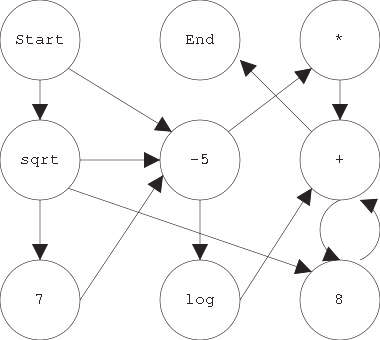

# Nature-inspired Search & Optimisation

## Lecture 15 : Genetic Programming

### 1.  Genetic Programming

- Content view:
  - Automatic programming
  - Creation of programs by artificial evolution
  - Different representations
- Representation view:
  - Anything using tree representation
  - May be programs, may be other things

### 2. Representing Programs in EC

- Tree representation
  - LISP-like expression
  - Local data storage
  - Tree **genotypes**
  - Tree genetic operators
  - **Stack** for data storage
- Linear representation
  - Series of instructions
  - **Registers** for data storage
- Graph representation
  - Nodes contain instructions
  - Edges control program flow
  - **Stack** for data storage

#### Example: Symbolic Regression

- Given: a set of function points

- Problem: find a function that fits the points as **closely** as possible

  

|  |
| :----------------------------------------------------------: |
|     *Fig 1. Tree representation for symbolic regression*     |

### 3. The Terminal Set

Anything with **arity** of 0 and only 1 output.

[^Arity]: Number of inputs.

- Inputs
  - Sensors
  - Function variables
- Constants
  - Numbers

### 4. The Function Set

- n-ary functions:
  - Arithmetic functions - +, -, *, /, log, sum,...
  - Boolean functions - and, or, not, xor,...
  - Memory functions - store, read
  - Control structures - if..then..else, for, ...
  - Side-effect functions - move, pen up, turn, ...
- Sufficiency
  - Need a set of functions sufficiently complex for the task.
  - But not too rich.
- Coverage
  - Functions need to be defined over **all inputs**.
  - e.g. division needs to be defined for input 0.

### 5. Crossover

- Branch swap

  1. Pick random branch at each parent.

  2. Swap branches.

- Matched 1-point tree crossover

  1. From root to branches.
  2. As long as node have same arity.
  3. Same crossover point for both parents, within matched branches.
  4. N-point crossover is possible.

### 6. Mutation

- Branch replacement
  1. Pick random branch from parent.
  2. Delete branch.
  3. Replace with random new branch.
  4. New branch created as in initial population creation.

### 7. Creation of Initial Population

- Full method

  - With fixed tree **depth** *treeDepth*:

  1. DO add random function nodes UNTIL all branches have (*treeDepth* -1) depth.
  2.  Add random **terminal** nodes to all branches.

- Growth method

  - With fixed **maximum** tree depth *maxDepth*:

  1. DO add random function or terminal nodes UNTIL all branches have terminals or are at (*maxDepth* - 1) depth.
  2. Add random terminal **nodes** to all branches without terminals.

- Ramped half-and-half

  - With fixed **maximum** tree depth *maxDepth* and **population size** *popSize*:

  - FOR n=2 to *maxDepth* **create**:
    1. (*popSize*/2*(*maxDepth* -1)) individuals using growth method with *maxDepth*=n.
    2. (*popSize*/2*(*maxDepth* - 1)) individuals using full method with *treeDepth*=n.

### 8. Bloat

- Program size grows:
  - As a result of uneven crossover and unused code.
  - Mutation, crossover of unused code - identical offspring behaviour.
  - Slows down runs. More space, CPU time required.
- Countermeasures
  - Incorporate program size into fitness.
  - Use special crossover, e.g. matched one-point crossover.

### 9. Other Representations

- Linear representation - Register machine:
  - Van-Neuman architecture
  - **String** of instructions and data
  - Functions get **arguments** from registers
  - String representation
  - Usually **variable-length**
  - Crossover: Variable-length versions of one-point, two-point.
  - Mutation: 'Usual' random gene replacement, add, delete operations.
- Graph representation - **Nodes** define operations:
  - Operands come from stack.
  - Result will be put onto the stack.
  - Edges define control flow.
  - Control mechanism controls which edge to follow.
  - Loops and recursion are common.
  - Specialised crossover and mutation operators.

|  |
| :--------------------------------------------------: |
|            *Fig 2. Graph representation*             |

### 10. Genetic Programming == Automatic Programming?

- Does it start from a **high level** specification?
- Does it produce an **executable** program?
- Does it **automatically** determine the number of steps a program should take?
- Does it produce results that are **competitive** with human?

- Applications:
  - Regression - Data Mining
  - Control - Robots
  - Design - NN

