# Pipeline

### 1. DQN

$$
Y_t^{DQN} = R_{t+1}+\gamma \max_a Q(S_{t+1}, a;\theta_t^-)
$$

```mermaid
graph LR
A[Select actions]-->|ε-greedy| B[Interaction]
C[Image] -->|Preprocess| E[State] --> F
D[Reward] --> F[Transition]
subgraph Physical simulator
B -->|Render| C
B -->|Observe| D
end
subgraph Memory
F
G[Transition]
end

```

### 2. Double DQN

$$
Y_t^{DoubleDQN} = R_{t+1}+\gamma Q(S_{t+1}, \arg\max_a Q(S_{t+1}, a;\theta_t), \theta_t^-)
$$

